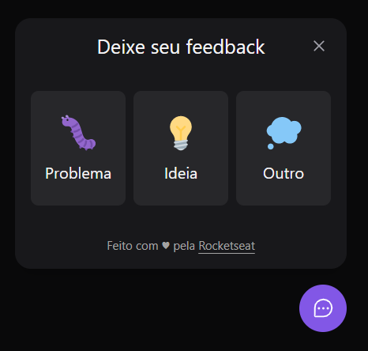
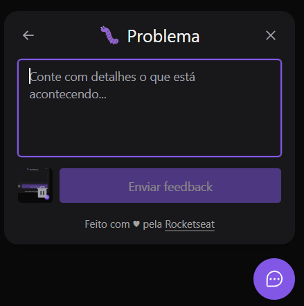

## Content
- [Sobre](#sobre)
- [Projeto](#projeto)
  - [Desafios](#desafios)
  - [Imagens do Projeto](#imagens-do-projeto)
- [Autor](#autor)

## Sobre

Nesse projeto você poderá dar seu feedback para a staff da página juntamente de uma imagem de screenshot. O feedback poderá ser:

<ul>
  <li>Problema </li>
  <li>Bug </li>
  <li>Outro </li>
</ul>

## Projeto

Next Level Week 8ª edição - Rocketseat. Projeto realizado com React, Typescript, Tailwind CSS, Axios, Headless UI, Jest, PrismaDB.

### Desafios

O maior desafio foi acompanhar e aprender sobre backend com PrismaDB. Também unir o frontend com o backend. Ao final do projeto, senti que superei o desafio e pude aprender bastante sobre backend e também melhorar minhas habilidades com o frontend

### Imagens do Projeto

  
  

## Autor

<table>
  <tr>
    <td align="center">
      <a href="https://www.linkedin.com/in/rafael99ldm/">
         
        
          <b>Rafael Lima</b>
        
      </a>
    </td>
  </tr>
</table>
